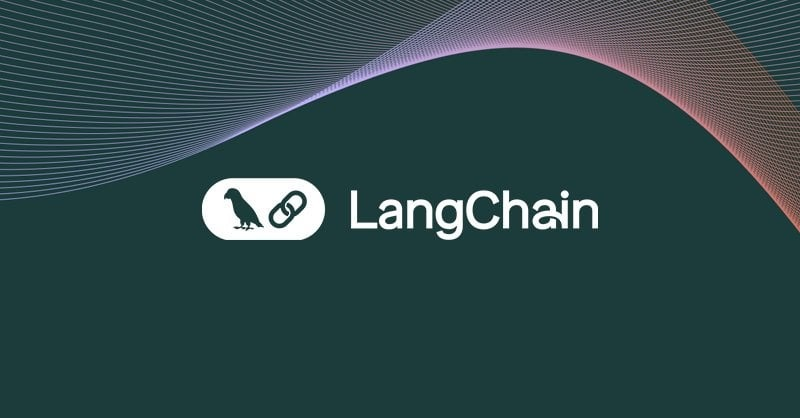

# Langchain Model for Question-Answering (QA) and Document Retrieval using Langchain

This is a Python script that demonstrates how to use different language models for question-answering (QA) and document retrieval tasks using Langchain. The script utilizes various language models, including OpenAI's GPT and Ollama open-source LLM models, to provide answers to user queries based on the provided documents.


<br>

## Installation

1. Clone the repository:
    ```bash
    git clone https://github.com/Vargha-Kh/Langchain-RAG-DevelopmentKit
    cd Langchain-RAG-DevelopmentKit
    ```

2. Install the required dependencies:
    ```bash
    pip install -r requirements.txt
    ```

## Workflow
1. File Format and Model Type:

    The script supports multiple file support together for loading documents: 'pdf', 'py', 'csv', and 'txt'. You can specify the desired file format and model type using command-line arguments.

- --directory: Specify the directory containing the input files (e.g., 'html', 'pdf', or 'txt' files).
- --vectorstore: Specify the vectorstore you want you use (options: qdrant, chroma, milvus, neo4j, ...)
- --model_type: Choose the model type to use for processing (options: 'gpt-4', 'gpt-4o', 'gpt-4-vision', 'llama:7b', 'mistral', etc.).

2. Input Documents:

    Place your documents in the specified directory. The script will read the documents based on the provided file format (e.g., 'html', 'pdf', or 'txt'). For using webloader, create urls.txt in the directory including the target links.

3. Run the Script:

    Run the script in your terminal or command prompt with the desired command-line arguments. For example:

    ```
    python rags.py --directory ./data --model_type gpt-4o --vectorstore qdrant --embeddings_model ollama --file_formats txt pdf --model_choice openai --use_mongo_memory --use_cohere_rank --use_multi_query_retriever --use_contextual_compression --use_hyde
    ```

4. Enter Queries:

    Once the script is running, it will prompt you to enter your question/query. It will then use the selected model to find relevant answers or retrieve relevant documents.

5. Results:

    The script will display the answer or retrieved documents based on the provided question/query.


<br>

## Streamlit Usage
For initializing Steamlit UI for running Langchain RAG:
```
streamlit run main.py --directory /path/to/documents --model_type "rag_chain" --vectorstore "milvus" --file_format ['txt', 'csv']
```

<br>


## Usage

To run the Langchain Model:

1. Set up your environment by configuring the necessary API keys in your environment variables.

2. Run the main script:
    ```bash
    python rags.py --directory ./data --model_type gpt-4o --vectorstore qdrant --file_formats txt pdf --model_choice openai --use_mongo_memory --use_cohere_rank --use_multi_query_retriever --use_contextual_compression --use_hyde
    ```

### Command Line Arguments

- `--directory`: Path to the data directory for ingesting files (default: `./data`).

- `--model_type`: Type of language model to use. Options include:
  - `react_agent`
  - `gpt-4`
  - `gpt-4o`
  - `gpt-4-vision`
  - `llama3:70b`
  - `llama:7b`
  - `agentic_rag`
  - `adaptive_rag`
  - `claude`
  - `mistral`
  - `mixtral`
  - `code_assistant`
  - and more.

- `--vectorstore`: Choose the vector store for embedding the data:
  - `chroma`
  - `milvus`
  - `weaviate`
  - `qdrant`
  - `pinecone`
  - `faiss`
  - `elasticsearch`
  - `opensearch`
  - `openclip`
  - `vectara`
  - `neo4j`

- `--embeddings_model`: Choose the embeddings model to use (default: `openai`). Options include:
  - `openai`
  - `ollama`
  - `elasticsearch`
  - `mistralai`
  - `pinecone`
  - `voyage`
  - `fastembed`
  - `huggingface`


- `--file_formats`: List of file formats for loading documents (default: `['txt', 'pdf']`).

- `--use_mongo_memory`: Use MongoDB for chat history (optional flag).

- `--use_cohere_rank`: Use Cohere Rank for retriever compression (optional flag).

- `--use_multi_query_retriever`: Use MultiQueryRetriever to enhance retrieval (optional flag).

- `--use_contextual_compression`: Use Contextual Compression Retriever to compress retrieved documents (optional flag).

- `--use_hyde`: Use Hypothetical Documents Embedder (optional flag).

### Example Command

```bash
python rags.py --directory ./data --model_type gpt-4o --vectorstore qdrant --embeddings_model ollama --file_formats txt pdf --use_mongo_memory --use_cohere_rank --use_multi_query_retriever --use_contextual_compression --use_hyde
```

<br>

## LangchainModel Class

### Description

The `LangchainModel` class handles different types of language models and provides methods to initialize and query these models.

### Initialization

You can initialize the `LangchainModel` with various options to customize its behavior:

```python
from rags import LangchainModel

# Initialize the LangchainModel with specific options
model = LangchainModel(
    llm_model="gpt-4o",
    vectorstore_name="qdrant",
    use_mongo_memory=True,
    use_cohere_rank=True,
    use_multi_query_retriever=True,
    use_contextual_compression=True,
    use_hyde=True,
    embeddings_model="ollama"
)
```

### Methods

- `model_chain_init(data_path, data_types)`: Initializes the model chain with the provided data path and data types.

- `query_inferences(query_input)`: Performs inference based on the query input and the model type.

### Modules and Options

#### Language Models

- **OpenAI GPT**: Use OpenAI's GPT models such as `gpt-4`, `gpt-4o`.
- **Anthropic Claude**: Use Anthropic's Claude model.
- **Open Source Models via Ollama**: Use open-source models through Ollama integration.

#### Vector Stores

Integration with multiple vector stores for embedding data:

- **Qdrant**
- **Milvus**
- **Chroma**
- **ElasticSearch**
- **Neo4j**
- **and more**

#### Embeddings Models

Choose from various embeddings models for document embedding:

- **OpenAI Embeddings** (`openai`): Default embeddings model using OpenAI's embeddings.
- **Ollama Embeddings** (`ollama`): Embedding for open-source models hosted by ollama.
- **Elasticsearch Embeddings** (`elasticsearch`): Integrates with Elasticsearch for embeddings.
- **Mistral AI Embeddings** (`mistralai`): Uses Mistral AI for embeddings.
- **Pinecone Embeddings** (`pinecone`): Utilizes Pinecone for embeddings.
- **Voyage AI Embeddings** (`voyage`): Employs Voyage AI for embeddings.
- **FastEmbed Embeddings** (`fastembed`): Uses FastEmbed for quick embeddings.
- **HuggingFace Embeddings** (`huggingface`): Integrates with HuggingFace models for embeddings.

#### Agent Architectures

Leverage agent architectures like:

- **AgenticRAG**
- **AdaptiveRAG**
- **SelfRAG**
- **Reflexion**
- **PlannerAgent**

#### Tools

Utilize a range of tools such as:

- **Google Search**
- **Tavil Search**
- **Bing Search**
- **Retrieval Tools**
- **Huggingface Tools**
- **Python REPL**
- **and more**


#### Agentic RAG Flow:

### Advanced Options

#### `embeddings_model`

This option allows you to select the embeddings model to use for document embedding. Supported embeddings models include:

- **OpenAI Embeddings** (`openai`): Default embeddings model using OpenAI's embeddings.
- **Ollama Embeddings** (`ollama`): Embedding for open-source models hosted by ollama.
- **Elasticsearch Embeddings** (`elasticsearch`): Integrates with Elasticsearch for embeddings.
- **Mistral AI Embeddings** (`mistralai`): Uses Mistral AI for embeddings.
- **Pinecone Embeddings** (`pinecone`): Utilizes Pinecone for embeddings.
- **Voyage AI Embeddings** (`voyage`): Employs Voyage AI for embeddings.
- **FastEmbed Embeddings** (`fastembed`): Uses FastEmbed for quick embeddings.
- **HuggingFace Embeddings** (`huggingface`): Integrates with HuggingFace models for embeddings.

#### `use_cohere_rank`

When this option is enabled (`--use_cohere_rank`), the script utilizes **Cohere's reranking capabilities** to improve the relevance of retrieved documents. Cohere Rank reorders the retrieved documents based on their relevance to the query, enhancing the quality of the information provided.

#### `use_multi_query_retriever`

Enabling this option (`--use_multi_query_retriever`) activates the **MultiQueryRetriever**. Instead of using a single query to retrieve documents, the MultiQueryRetriever generates multiple semantically similar queries to retrieve a broader and more diverse set of relevant documents from the vector store.

#### `use_contextual_compression`

When this option is set (`--use_contextual_compression`), the script uses a **Contextual Compression Retriever**. This retriever compresses the retrieved documents to focus on the most relevant information, reducing the amount of irrelevant data and improving the efficiency of the model's responses.

#### `use_mongo_memory`

By enabling this option (`--use_mongo_memory`), the script stores and retrieves chat history using **MongoDB**. This allows the model to maintain conversation context across different sessions and scale beyond in-memory limitations.

#### `use_hyde`
When this option is enabled (--use_hyde), the script incorporates Hypothetical Document Embeddings (HYDE) into the retrieval process. HYDE works by generating hypothetical answers to the user's query using a language model and then embedding these hypothetical answers. These embeddings are then used to enhance the retrieval of relevant documents from the vector store. By matching the hypothetical answers to the documents, HYDE can improve the quality of retrieved documents, especially in cases where the original query might not be sufficient to find relevant information.

### Example

```python
from rags import LangchainModel

# Initialize the LangchainModel with specific options
model = LangchainModel(
    llm_model="gpt-4o",
    vectorstore_name="qdrant",
    embeddings_model="ollama"
    use_mongo_memory=True,
    use_cohere_rank=True,
    use_multi_query_retriever=True,
    use_contextual_compression=True,
    use_hyde=True
)

# Initialize the model chain
model.model_chain_init(data_path="./data", data_types=["txt", "pdf"])

# Query the model
results, result = model.query_inferences("What is the capital of France?")
print(results)
```

<br>

# Important Note
Please ensure that you have valid API keys and access to the required models and services before running the script. Additionally, make sure the input documents are placed in the specified directory and are in the correct format (e.g., `'html'`, `'pdf'`, or `'txt'`).

**Environment Variables:**

- **OpenAI API Key**: Set `OPENAI_API_KEY` in your environment.
- **Anthropic API Key**: Set `ANTHROPIC_API_KEY` if using Claude.
- **Cohere API Key**: Set `COHERE_API_KEY` if using Cohere Rank.
- **MongoDB Connection String**: Ensure MongoDB is running and accessible if using `--use_mongo_memory`.
- **Elasticsearch Credentials**: Set `ES_CLOUD_ID`, `ES_USER`, and `ES_PASSWORD` if using Elasticsearch embeddings.
- **Pinecone API Key**: Set `PINECONE_API_KEY` if using Pinecone embeddings.
- **Voyage API Key**: Set `VOYAGE_API_KEY` if using Voyage AI embeddings.
- **Other Embeddings Models**: Set any additional required environment variables based on the chosen embeddings model.


**RAG init Note:** The script now supports optional components such as MongoDB memory, Cohere Rank, MultiQueryRetriever, and Contextual Compression Retriever. These can be enabled or disabled using the respective command-line arguments. This allows you to customize the retrieval and response process according to your requirements.
