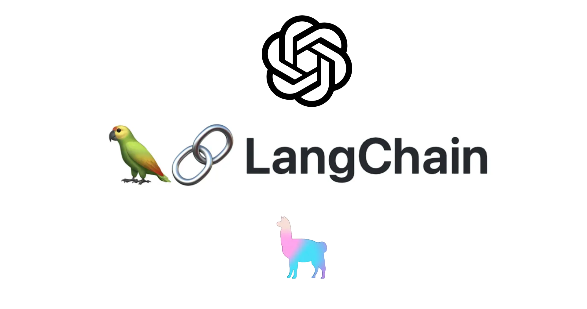
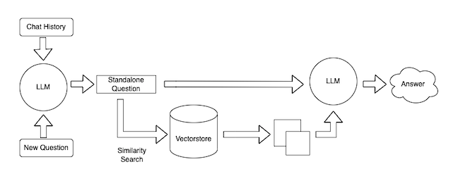

# Langchain Model for Question-Answering (QA) and Document Retrieval using Langchain

This is a Python script that demonstrates how to use different language models for question-answering (QA) and document retrieval tasks using Langchain. The script utilizes various language models, including OpenAI's GPT and Ollama open-source LLM models, to provide answers to user queries based on the provided documents.


<br>

## Installation

1. Clone the repository:
    ```bash
    git clone https://github.com/your-repo/langchain-model.git
    cd langchain-model
    ```

2. Install the required dependencies:
    ```bash
    pip install -r requirements.txt
    ```

## Workflow
1. File Format and Model Type:

    The script supports multiple file support together for loading documents: 'pdf', 'py', 'csv', and 'txt'. You can specify the desired file format and model type using command-line arguments.

- --directory: Specify the directory containing the input files (e.g., 'html', 'pdf', or 'txt' files).
- --vectorstore: Specify the vectorstore you want you use (options: qdrant, chroma, milvus, neo4j, ...)
- --model_type: Choose the model type to use for processing (options: 'gpt-4', 'gpt-3.5', 'llama-b7' or 'mistral').

2. Input Documents:

    Place your documents in the specified directory. The script will read the documents based on the provided file format (e.g., 'html', 'pdf', or 'txt'). For using webloader, create urls.txt in the directory including the target links.

3. Run the Script:

    Run the script in your terminal or command prompt with the desired command-line arguments. For example:

4. Enter Queries:

    Once the script is running, it will prompt you to enter your question/query. It will then use the selected model to find relevant answers or retrieve relevant documents.

5. Results:

    The script will display the answer or retrieved documents based on the provided question/query.



<br>

## Streamlit Usage
For initializing Steamlit UI for running Langchain RAG:
```
streamlit run main.py --directory /path/to/documents --model_type "gpt-4" --vectorstore "milvus" --file_format ['txt', 'csv']
```

<br>


## Usage

To run the Langchain Model:

1. Set up your environment by configuring the necessary API keys in your environment variables.

2. Run the main script:
    ```bash
    python rags.py --directory <data-directory> --model_type <model-type> --file_formats <file-formats>
    ```

### Command Line Arguments

- `--directory`: Path to the data directory for ingesting files (default: `./pdf_data`).

- `--model_type`: Type of language model to use. Options include:
  - `react_agent`
  - `gpt-4o`
  - `gpt-4-vision`
  - `llama3:70b`
  - `agentic_rag`
  - `adaptive_rag`
  - `claude`
  - `....`

- `--vectorstore`: Choosing the vectorstore for embedding the data:
  - `chroma`
  - `milvus`
  - `weaviate`
  - `qdrant`
  - `pinecone`
  - `faiss`
  - `elasticsearch`
  - `opensearch`
  - `openclip`
  - `vectara`
  - `neo4j`

- `--file_formats`: List of file formats for loading documents (default: `['txt', 'pdf']`).

<br>

## LangchainModel Class

### Methods

You can use the models and create instances from the rags.py code with specifying each modules.

### Modules
This repository supports various language models, vector stores, agent architectures, and tools:

- Language Models: Use different LLMs such as GPT, Claude, LLaMA, and more.
- Vector Stores: Integration with multiple vector stores including Qdrant, Milvus, Chroma, ElasticSearch, Neo4j Embeddings, and more.
- Agent Architectures: Leverage agent architectures like AgenticRAG, AdaptiveRAG, SelfRAG, Reflexion, PlannerAgent.
- Tools: Utilize a range of tools such as Google Search, Tavil Search, Bing Search, Retrieval tools, Huggingface tools, Python REPL, and more.


### Example

```python
from rags import LangchainModel

# Initialize the LangchainModel with a specific model type
model = LangchainModel(llm_model="gpt-4", vectorstore="qdrant")

# Initialize the model chain
model.model_chain_init(data_path="./data", data_types=["txt"])

# Query the model
results, result = model.query_inferences("What is the capital of France?")
print(results)
```

<br>

# Important Note
Please ensure that you have valid API keys and access to the required models before running the script. Additionally, make sure the input documents are placed in the specified directory and are in the correct format (html, pdf, or txt).
